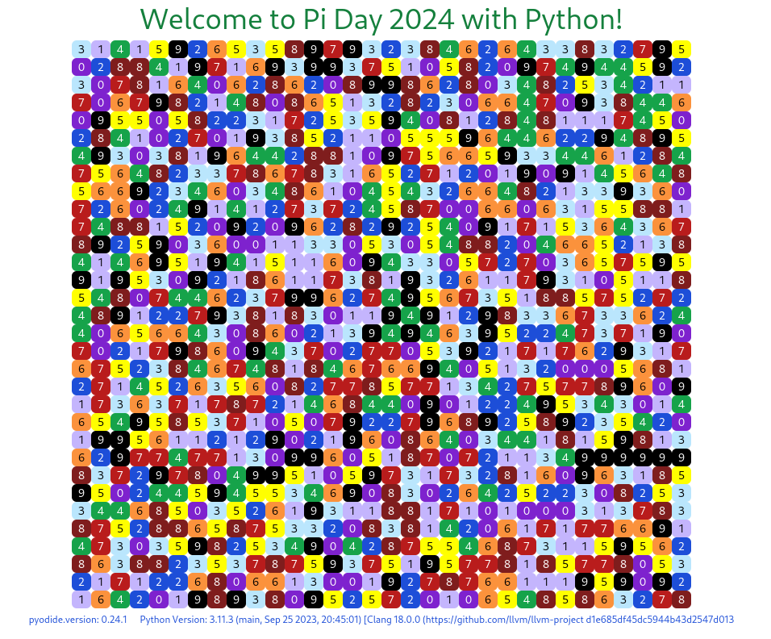

# pi-day-2024-with-py

This is a reimplementation of [pi-day-2021-with-py](https://github.com/klmcwhirter/pi-day-2021-with-py).

It uses [SolidJS](https://www.solidjs.com/) and [pyodide](https://pyodide.org/).

Pyodide provides Python as a WASM component which contains the pi digit generator logic! The UI interacts with the Python WASM component via Typescript.

The meat of that is in [pyodide.loader.ts](./src/py/pyodide.loader.ts) and the [piadapter](./piadapter/__init__.py) Python module.

> Please note that this is an absolutely useless architecture pattern. Don't use it!
>
> But it was fun to build and shows something else that is possible with WASM.

## Notes

- [References](References)
- [TODO](TODO)
