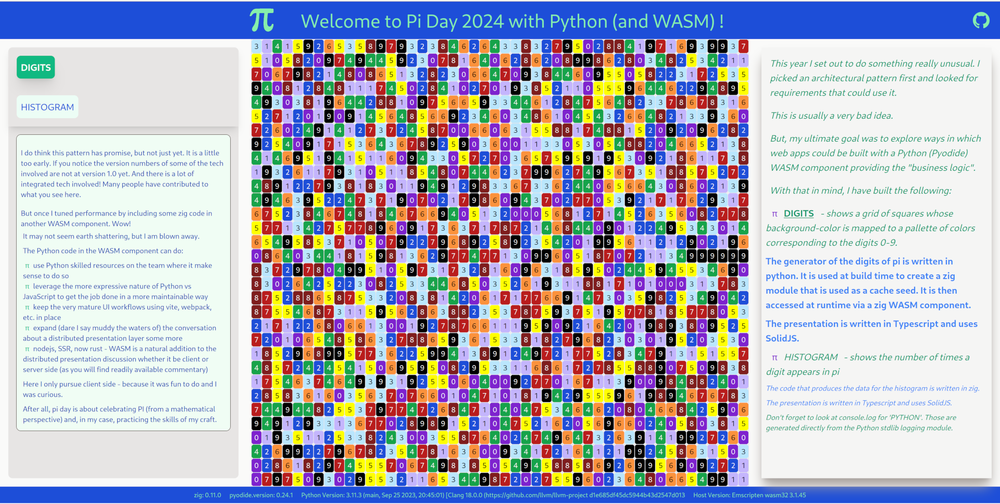

# &pi; pi-day-2024-with-py

##### Table of Contents

- [Overview](#overview)
- [Branches](#branches)
- [Run it](#run-it)
- [Run With Other WASM](#run-with-other-wasm)
- [Why pyodide?](#why-pyodide)
- [Why AssemblyScript?](#why-assemblyscript)
- [Summary](#summary)
- [Downsides](./docs/wasm-downsides.md)
- [Rabbit Holes I Travelled Down](./docs/rabbit-holes.md)
- [References](./docs/references.md)

---

---

## Overview

In spirit, this is just a reimplementation of [pi-day-2021-with-py](https://github.com/klmcwhirter/pi-day-2021-with-py). But it is, oh, so much more than that.

It uses [SolidJS](https://www.solidjs.com/), [pyodide](https://pyodide.org/), [assemblyscript](https://www.assemblyscript.org/), [tinygo](https://tinygo.org/docs/guides/webassembly/wasm/) and [zig](https://ziglang.org/) and runs completely in the browser!

Pyodide provides Python (version 3.11.3 as I write this including most of stdlib and several data science libs) as a WASM component which runs in the browser. I use it via an adapter (or Proxy) because it contains the pi digit generator logic written in Python!

The UI interacts with the Python WASM and, by default, an assemblyscript WASM component via Typescript. go and zig options are available as well.

The meat of that is in [pyodide.loader.ts](./src/pi/pyodide.loader.ts) and the [piadapter](./piadapter/__init__.py) Python module, and [pi-as](./pi-as/assembly/index.ts) assemblyscript module.

These are the main features represented by the screenshots below.

- 1536 Digits of Pi - [pi-day-2024-digits.png](./docs/pi-day-2024-digits.png) - this is a repeat of my [pi-day-2021-with-py](https://github.com/klmcwhirter/pi-day-2021-with-py) project where I did something similar with guizero
- A histogram of the occurrences of the base 10 digits in the first _selectable_ digits of pi - [pi-day-2024-histogram.png](./docs/pi-day-2024-histogram.png). The drop down contains values for 10 up to 50,000 digits of pi.
- [pi-day-2024-footer.png](./docs/pi-day-2024-footer.png) - hover over the footer to see version information from the zig, the python and Typescript parts of the app.
- the loading screen that hides the initialization process is [pi-day-2024-loading.png](./docs/pi-day-2024-loading.png)

> Please note that this is an absolutely useless architecture pattern. Don't use it!
>
> But it was fun to build and shows something else that is possible with WASM.

## Branches
This repo has multiple branches depicting different stages of development.

Branch|Contains
------|--------
master|Most current development work
without-pyodide|Removed all python, tinygo and zig code; single wasm produced by AssemblyScript; Python generates pi_digits_seed.ts during build. This is the most performant, but this is "Pi day with Py" so leaving Python in master ;)
without-wasm|No wasm component at all; all in Typescript; Python generates pi_digits_seed.ts during build
python-generated|State of code after moving to generate pi_30000.py as Python code
python-only|Right before moving to generate pi_30000.py during build; all calcs still in Python

### Features per branch
The master branch has the most flexibility in that it allows technologies to be swapped by chnging the dockerfile reference in `docker-compose.yml`. But that option is not available in the other branches.

Branch|Feature
------|-------
master|Containerfile_as, Containerfile_tinygo, Containerfile_zig
without-pyodide|Containerfile
without-wasm|Containerfile
python-generated|Dockerfile
python-only|Dockerfile

## Run it

### Uses Docker as the only dependency ...

The build and deployment process relies on Docker and docker-compose. But those are the only dependencies (aside from an internet connection).

Just run `docker-compose up` and open [http://localhost:9000/](http://localhost:9000/) in a browser.

The build process takes a little less than 3 mins on my laptop. So be patient before clicking on the link above.

You will see output like the following when it is done building and is ready for the browser:

```
podman start -a pi-day-2024-with-py_piday2024_1
[piday2024] | 
[piday2024] | > vite-template-solid@0.0.0 start
[piday2024] | > vite
[piday2024] | 
[piday2024] | 
[piday2024] |   VITE v4.5.0  ready in 437 ms
[piday2024] | 
[piday2024] |   ➜  Local:   http://localhost:9000/
[piday2024] |  ...
```

Hit CTRl-C in the terminal where `docker-compose up` was executed to exit.

Then run `docker-compose down`.
If you have no other docker images that you want to keep then run this to finish the clean up: `docker system prune -af`.

### NixOS Flakes
If you are uing the nix package manager with flakes enabled, then simply doing the following will setup the environment and output a reminder of next steps.

> The next steps reminders assume you are running nixos in a VM like I am.

`$ nix develop`

### podman

 By the way, yes, podman-compose works as well.
 To run do: `podman-compose up`.

 When ready to exit hit CTRL-C as with docker.

 Use `podman-compose down -t 0` to expedite the shutdown process. The default is to timeout in 10 secs.

 To clean up do `podman system prune -af`.

## Run With Other WASM
You will notice the reference to the WASM technology in [docker-compose.yml](./docker-compose.yml)

```
dockerfile: Containerfile_as
```

The `dockerfile` can be changed to any of these values:

Value|Technology
----|-------
[Containerfile_as](./Containerfile_as)|[AssemblyScript](https://www.assemblyscript.org/introduction.html)
[Containerfile_tinygo](./Containerfile_tinygo)|[TinyGO](https://tinygo.org/docs/guides/webassembly/wasm/)
[Containerfile_zig](./Containerfile_zig)|[zig](https://ziglang.org/documentation/0.11.0/#Freestanding)

## Why pyodide?

I started looking at PyScript because it was getting so much press. But, as I found out, it was solving a different problem. They are focusing on making it easier for data scientists - only familiar with Python - to get their analysis onto the web. As such it assumes that Python is king and takes almost complete control of the loaded DOM.

_FYI, [iodide](https://github.com/iodide-project/iodide) is another interesting project, but sadly it is no longer under development._

And, both PyScript and iodide use pyodide internally to accomplish their goals.

I did take a cursory look at a few other things like iodide (that also uses pyodide) and the WASM/WASI tooling being built into cpython itself.

Nothing I found was as ready to use as pyodide - search stopped there for now.

## Why AssemblyScript?
After trying emscripten with C, and zig and tinygo I was disappointed at the complexity involved to get something running.

With [assemblyscript](https://www.assemblyscript.org/) I was able to get a simple WASM component working in an afternoon.

And the performance has been amazing. Where Python was taking ~10 secs to generate histograms for 10,100,1000,1024,10000,20000,25000 and 30000 digits of pi - the WASM code is capable of performing the same thing plus 35000, 40000, 45000 and 50000 in less than 1 ms. Yep 1ms! Wow. The histograms are still generated at runtime. Via a separate WASM call per value of N digits of pi.

> The languages I worked with all have a slice type in their language. So I just couldn't help myself referring to it as a slice_of_pi in the code. Tee hee hee. _See the histogram function in [pi-as/assembly/index.ts](./pi-as/assembly/index.ts)._

Note I changed the Python cache seed generation logic to produce pi_digits_seed.ts instead of pi_30000.py. _See the bottom of [piadapter/pi_digits.py](./piadapter/pi_digits.py)._

> Note I did some digging and saw that some of the individual coefficient values for the Gosper's series algorithm I settled on
> exceeds 4000 integer digits! WHOA. Python is the right choice for the language to perform that task.

The as module exposes pi_digits via its WASM interface and that is called and passed into the Python based PiAdapter class during startup (via pyodide).

Did I mention with the other WASM components the startup time went from ~20 secs to ~2.5 secs. Most of what is left is the pyodide startup time.

The pyodide wasm file is 9**MB**! _That is fair if you think about it. It contains the almost complete Python 3.11 runtime plus
the [various libraries they have ported](https://pyodide.org/en/stable/usage/packages-in-pyodide.html) like attrs, numpy, pandas, etc.

Whereas the pi-as.wasm file is ~58**KB**.


And, the assemblyscript WASM component is tremendously simpler in terms of the code to implement the WASM code and to consume it.

That is why assemblyscript ;)

## Summary

I do think this pattern has promise, but not just yet. It is a little too early. If you notice the version numbers of some of the tech involved are not at version 1.0 yet. And there is a lot of integrated tech involved! Many people across many projects have contributed to what you see here.

The result may not seem earth shattering on the surface, but I am blown away.

The Python code in the WASM component can do:

- NOT data crunching (data science libraries e.g., numpy, pandas, etc. come built into pyodide) - even though I am not using them on purpose, and not much can be done really - see [Downsides](./docs/wasm-downsides.md)
- NOT make API calls
- use Python skilled resources on the team more where it make sense to do so
- leverage the more expressive nature of Python vs JavaScript to get the job done in a more maintainable way
- keep the very mature UI workflows using vite, webpack, etc. in place
- expand (dare I say muddy the waters of) the conversation about a distributed presentation layer some more
- nodejs, SSR, now rust - WASM is a natural addition to the distributed presentation discussion whether it be client or server side (as you will find readily available commentary)
- integrating with other WASM components that will become available as things mature

WASM is great for CPU or I/O intensive operations. They execute at near native speeds.

I have 3 implementations: [assemblyscript](./pi-as/) (as), [golang](./pi-tinygo/) (tinygo) and [zig](./pi-zig/). At the end of the day it is just Web Assembly - they perform similarly. Executing the histogram function in &lt; 1ms
whereas pyodide takes multiple seconds per invocation. That is not Python's fault; just pyodide
overhead.

Here I only pursue client side - because it was fun to do and I was curious.

After all, pi day is about celebrating PI in any ludracous way imaginable (not just from a mathematical perspective) and, in my case, practicing the skills of my craft.
